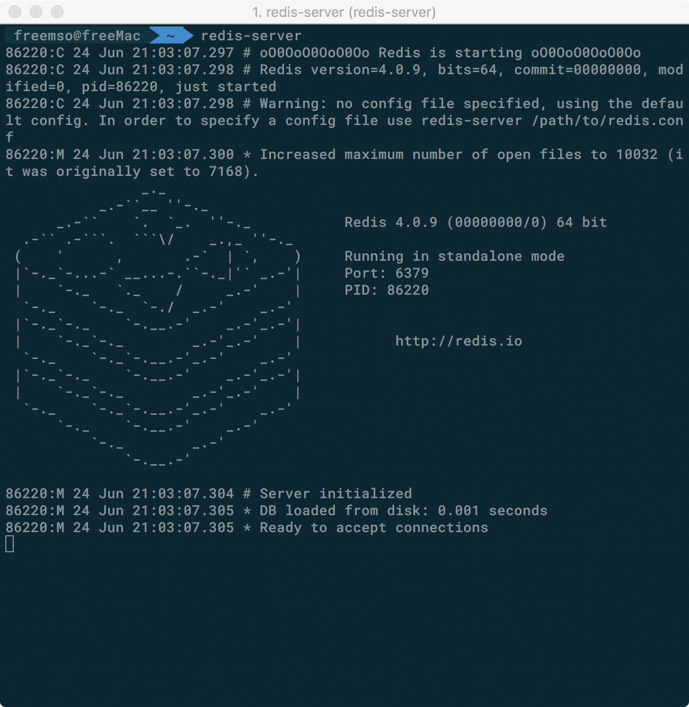
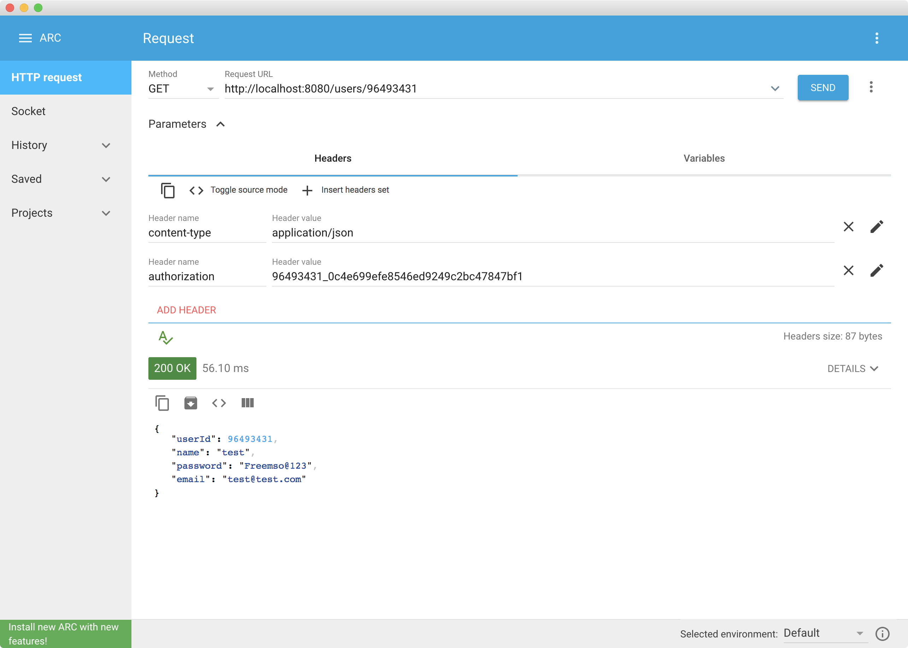

# Redis 内存数据库实践报告
*欧承祖 14302010037*
## 综述
在这个实践报告中，我们将学习搭建配置 Redis 内存数据库，并将其应用到课程 Project 里作为 Spring Boot RESTful 服务器用户登录身份认证的数据库。

## Redis 介绍


Redis 是一个开源的内存数据库。它支持诸如 strings，lists，sets 等多种数据结构，具有高效、高可扩展性、支持分布式集群等优点。

它在工业界应用广泛，笔者曾经实习过的公司 Boson Data 就在使用它。事实上，在数据库引擎的排名中，Redis 曾多次被评为最受欢迎的 key-value 数据库。

主流的编程语言都有对 Redis 的第三方库支持，比如说 Java 就有 Jedis 和 Lettuce 等 Redis 客户端。我们在这个报告中使用的就是 Jedis 这个轻量级 Redis 客户端。

与其他典型的 key-value 数据库不同，Redis 最大的特点是：它是内存数据库。普通的数据库一般使用磁盘作为数据存储介质，而内存数据库主要依赖内存。显然，内存数据库最大的好处就是它的高效。无论是读操作还是写操作，内存数据库往往都能比一般的磁盘数据库快好几个数量级。不过有得必有失，内存数据库也有一个致命的弱点：它无法在很高层级保证数据的持久性。这并不是说内存数据库里的数据库没有办法持久化，Redis 是支持将数据持久化到磁盘的。这句话说的是，在极端情况下，比如突然断电等，内存数据库里的数据将会面临丢失的风险。因此，我们一般只有在临时存储，或者存储不太重要的数据时才会使用内存数据库——即使数据丢失，也没有太大影响。

## 环境配置
本实验是在一台 MacBook Pro (late 2017) 上的 macOS 10.13.5 High Sierra 系统上完成。JDK 版本是 `1.8.0_172`。

首先安装 Redis。由于我们是在 macOS 系统上，所以可以方便地使用 Homebrew 包管理器来安装 Redis。
```bash
> brew install redis
```

安装好之后，无需额外配置，使用默认配置即可。

之后，在命令行启动 Redis 数据库。
```bash
> redis-server
```

即可看到如下消息。


现在，Redis 数据库已经在后台运行，等待接受连接了。默认配置下，Redis 监听本地的 `6379` 端口。

Redis 在安装的时候提供了一个 command line interface，可以使用它连接数据库做一些简单的操作。


我们这个实验将使用 Spring Data 提供的接口来访问 Redis。

使用 Maven 作为 Spring 项目的包管理器，注意在 `pom.xml` 中引入 Redis 相关依赖。正如上面提到的，我们使用 Jedis 作为 Spring 连接 Redis 的客户端。
```xml
...
<dependency>
	<groupId>org.springframework.data</groupId>
	<artifactId>spring-data-redis</artifactId>
	<version>2.0.7.RELEASE</version>
</dependency>

<dependency>
	<groupId>redis.clients</groupId>
	<artifactId>jedis</artifactId>
	<scope>runtime</scope>
	<version>2.9.0</version>
</dependency>
...
```

## 实验背景
在这个实验中，我们将使用 Spring Boot 开发一个 RESTful 的服务器，并且使用 Redis 数据库存储用户登录状态。

REST 服务器是一个「无状态」的服务器，它不应当与客户端维持会话连接。但有时，我们又需要对客户端发来的请求，做一些访问权限的控制。比如说，只允许登录的用户查看自己的个人信息，不允许其他用户或者未登录用户查看。这时，如果使用传统的会话连接来维护登录状态，就会破坏 REST 服务器「无状态」的要求。而如果要求客户端每次发送请求时，都同时发送账户、密码等信息来做权限验证又未免太低效，而且有安全隐患。

我们的解决办法是，在用户登录时，REST 服务器创建一个 token，并且将 token 与用户 id 的对应关系存储起来，然后将 token 发送给客户端。客户端将 token 存放在本地，并且之后每次发送请求时将 token 放入 HTTP 头部中。服务器通过读取请求的头部 token 字段来验证用户的登录状态。token 有一个有效期，用户超过一段时间没有发送请求，服务器就会销毁这个 token，用户下次请求时，就需要重新登录。

可以看到，token 的存储与使用有如下几个特点：

1. **读取、写入频繁**，每个请求都需要读取和写入 token
2. **有失效期**，需要记录 token 上一次被访问的时间，并在超时后删除 token
3. **可丢失的数据**，token 只是保存用户登录状态的临时数据，即便丢失也没有太大影响

于是，我们考虑使用 Redis 作为 token 的存储数据库。Redis 作为内存数据库，有速度快的特点，适合与这种频繁的读取模式。Redis 中可以方便设置数据的 ttl，即存活时间。即便遇到突发事件，Redis 中的 token 数据丢失了，也不会有太大影响。

## 关键代码分析
首先我们需要配置 Spring 连接 Redis 的 connection factory。我们在这里使用 Jedis，这是一个轻量级的 Redis 客户端，与 Spring 兼容得很好。在配置类中添加如下两个 beans。
```java
@Bean
JedisConnectionFactory jedisConnectionFactory() {
	return new JedisConnectionFactory();
}

@Bean
RedisTemplate<Long, String> redisTemplate() {
	RedisTemplate<Long, String> template = new RedisTemplate<>();
	template.setConnectionFactory(jedisConnectionFactory());
	template.setKeySerializer(new JdkSerializationRedisSerializer());
	return template;
}
```
其中的 `redisTemplate` 是 Spring 用来操作 Redis 的模版。我们将在 Redis 中存入一些以用户 ID 为键，生成的 token 为值的键值对，因此，上面的 `redisTemplate` 使用 `Long` 作为键的数据类型，`String` 作为值的数据类型。

我们还需要一个 Repository 来管理对 token 的增删改查操作。它的接口类应当支持如下的操作：
```java
@Repository
public interface TokenRepository {
	/**
	 * Create a token with given user id
	 *
	 * @param id, user id
	 * @return created token
	 */
	TokenEntry createToken(long id);

	/**
	 * Check if tokenEntry is still valid
	 *
	 * @param tokenEntry, tokenEntry to be checked
	 * @return true for valid tokenEntry, false if not
	 */
	boolean checkToken(TokenEntry tokenEntry);

	/**
	 * Get token from authentication field of request head
	 *
	 * @param authentication, authentication field
	 * @return token
	 */
	TokenEntry getToken(String authentication);

	/**
	 * Get authentication from token entry
	 *
	 * @param tokenEntry, TokenEntry
	 * @return authentication string used to return to client
	 */
	String getAuthentication(TokenEntry tokenEntry);

	/**
	 * Delete token related to user
	 *
	 * @param id, user id
	 */
	void deleteToken(long id);

}
```

对应的使用 Redis 的实现是：
```java
@Repository
public class RedisTokenRepositoryImpl implements TokenRepository {

	private RedisTemplate<Long, String> redis;

	@Autowired
	public RedisTokenRepositoryImpl(RedisTemplate<Long, String> redis) {
		this.redis = redis;
	}

	@Override
	public TokenEntry createToken(long userId) {
		// 使用uuid作为源token
		String token = UUID.randomUUID().toString().replace("-", "");
		TokenEntry tokenEntry = new TokenEntry(userId, token);
		// 存储到redis并设置过期时间
		redis.boundValueOps(userId).set(token, Constants.TOKEN_EXPIRES_HOUR, TimeUnit.HOURS);
		return tokenEntry;
	}

	@Override
	public TokenEntry getToken(String authentication) {
		if (authentication == null || authentication.length() == 0) {
			return null;
		}
		String[] param = authentication.split("_");
		if (param.length != 2) {
			return null;
		}
		// 使用userId和源token简单拼接成的token，可以增加加密措施
		long userId = Long.parseLong(param[0]);
		String token = param[1];
		return new TokenEntry(userId, token);
	}

	@Override
	public String getAuthentication(TokenEntry tokenEntry) {
		return tokenEntry.getId() + "_" + tokenEntry.getToken();
	}

	@Override
	public boolean checkToken(TokenEntry tokenEntry) {
		if (tokenEntry == null) {
			return false;
		}
		String token = redis.boundValueOps(tokenEntry.getId()).get();
		if (token == null || !token.equals(tokenEntry.getToken())) {
			return false;
		}

		// 如果验证成功，说明此用户进行了一次有效操作，延长token的过期时间
		redis.boundValueOps(tokenEntry.getId())
			.expire(Constants.TOKEN_EXPIRES_HOUR, TimeUnit.HOURS);
		return true;
	}

	@Override
	public void deleteToken(long userId) {
		redis.delete(userId);
	}
}
```

至此，我们已经完成了 token 的数据层搭建，接下来就是如何使用 token 了。

由于用户登录状态验证是一个普遍而独立的步骤：它在大部分请求处理中都会用到，而且它与具体的每个请求要执行的逻辑相互独立。基于这一特点，我们考虑利用 Spring 的 AOP 特性，将这一步骤写成一个 Aspect，或者更具体地说，一个 Interceptor。

我们定义一个 `@Authorization` 注解来标志需要做用户登录状态验证的请求。
```java
/**
 * User this annotation on methods in controller.
 * It will check if the user is in createToken status.
 * If not, return 401 UNAUTHORIZED error
 * @see AuthorizationInterceptor
 */
@Target(ElementType.METHOD)
@Retention(RetentionPolicy.RUNTIME)
@Inherited
public @interface Authorization {
}
```

然后在 `AuthorizationInterceptor` 中，我们实现一个 `preHandle` 函数来对所有请求做一次验证。
```java
/**
 * Customized interceptor. Used to check if the request is authorized.
 *
 * @see Authorization
 */
@Component
public class AuthorizationInterceptor extends HandlerInterceptorAdapter {

	private TokenRepository tokenRepository;

	@Autowired
	public AuthorizationInterceptor(TokenRepository tokenRepository) {
		this.tokenRepository = tokenRepository;
	}

	public boolean preHandle(HttpServletRequest request,
							 HttpServletResponse response,
							 Object handler) {
		// If not on method, just return true
		if (!(handler instanceof HandlerMethod)) {
			return true;
		}

		HandlerMethod handlerMethod = (HandlerMethod) handler;
		Method method = handlerMethod.getMethod();
		// Get authorization field from header
		String authorization = request.getHeader(Constants.AUTHORIZATION);
		// Check the token
		TokenEntry tokenEntry = tokenRepository.getToken(authorization);
		if (tokenRepository.checkToken(tokenEntry)) {
			// Passed. Save current user id in request for future use
			request.setAttribute(Constants.CURRENT_USER_ID, tokenEntry.getId());
			return true;
		} else {
			// Failed.
			// If the method has a @Authorization annotation, return a 401 UNAUTHORIZED error
			if (method.getAnnotation(Authorization.class) != null) {
				response.setStatus(HttpServletResponse.SC_UNAUTHORIZED);
				return false;
			}
		}
		return true;
	}
}

```
可以看到，这个 Interceptor 会读取请求头部的一个名为 `Constants.AUTHORIZATION`（也就是 `"authorization"` ） 的字段，获取里面的 token。利用我们的 token 编码方式特点，可以从中解码出用户 ID，然后使用上面实现的 `tokenRepository` 在 Redis 数据库中查询 token 是否匹配。如果不匹配，并且当前 controller 中的方法被 `@Authorization` 标记，则表明这个请求时非法的，直接返回一个 `401 UNAUTHORIZED` 错误。

最后，我们在需要验证用户登录状态的 controller 方法上加 `@Authorization` 标记即可。
```java
/**
 * Get meta data of the user with id equals to {uid}.
 * Only authorized currentUser with the same id as {uid} could get
 * user private data. Others can't.
 *
 * @param uid, id of the user to get
 * @return user private data
 */
@GetMapping("/{uid}")
@Authorization
ResponseEntity<User> getUserPrivate(@CurrentUser User currentUser, @PathVariable long uid) {
	User user = this.userService.getUserPrivate(currentUser, uid);

	return new ResponseEntity<>(user, HttpStatus.OK);
}
```

完整的代码请看附件。

## 集成测试
我们使用 Advanced REST Client 来测试我们的用户认证系统，它一个 REST 服务的调试工具。

在后台开启 Redis 数据库和 Neo4j 数据库之后，我们在命令行启动我们 REST 服务器。


打开 ARC 之后，由于此时还没有注册用户，我们先向后台发送 POST 请求，注册一个用户。

可以看到，返回的数据是新注册的用户信息，它的 ID 是 `96493431`。

然后，我们发送登录请求，获得一个 token。为了遵循 REST API 设计规范中「一切都是资源」的要求，我们将登录请求看作是对 token 资源的创建请求。因此，我们发送 POST 请求到 `/token` 来创建 token。

得到的字符串 `96493431_0c4e699efe8546ed9249c2bc47847bf1` 就是新创建的 token。

现在，我们试图发送 GET 请求到 `/users/{uid}` 去得到用户的私密信息。正如上面说过的，这个请求是需要用户登录验证的。

我们先测试未登录状态——在 HTTP Header 中不添加 `"authorization"` 字段。

可以看到，如我们所料，后台返回了 `401 UNAUTHORIZED` 错误。

现在，我们在头部加入 `"authorization"` 字段，并在其中填入之前登录成功获得的 token。
 
后台成功返回了用户的私密信息。

## 总结
Redis 内存数据库是一个功能强大、使用方便的数据库。在例如用户登录状态存储这种读取频繁且数据丢失不敏感的应用场景下，使用 Redis 是一个很好的选择。从我们在 Spring Boot 上的实践上，可以看出其配置、使用的便捷性。

我们在课程项目的开发中，也使用到了 Redis。除了本文中实践的用户登录状态存储，我们还将其用作了用户注册邮箱验证码的临时存储数据库。